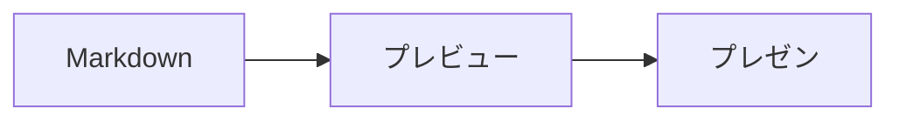

[English](README.md) | [中文](README.zh-CN.md) | [日本語](README.ja.md)

# Markdown Live Preview

[](https://marketplace.visualstudio.com/items?itemName=baryon.baryon-markdown-live-preview) [VS Marketplace からインストール](https://marketplace.visualstudio.com/items?itemName=baryon.baryon-markdown-live-preview)

モダンな VS Code Markdown プレビュー拡張機能 —— ドキュメントがまず生成され、次に読まれる AI 時代のために構築されました。

> プレビューファースト。AI の時代では、Markdown は書くよりも読むほうが多いから。

## スクリーンショット

| 画像フォーマット対応 | MDX サポート |
|:---:|:---:|
|  |  |
| **Marp プレゼンテーション** | **ASCII Mermaid** |
|  |  |
| **Recharts チャート** | |
|  | |

## なぜこの拡張機能なのか

Claude、ChatGPT、Copilot などの AI ツールは、技術ドキュメント、レポート、スライド、研究ノートなど、大量の Markdown を生成しています。ボトルネックはもはや執筆ではなく、生成されたコンテンツのレビューとプレゼンテーションです。Markdown Live Preview はこの現実に基づいて設計されています：ファイルを開き、レンダリングを確認し、ナビゲートし、プレゼンテーションする。

このプロジェクトは [Markdown Preview Enhanced](https://shd101wyy.github.io/markdown-preview-enhanced) に触発され、ゼロから書き直されました。重要な機能 —— ダイアグラム、数式、目次、プレゼンテーション、コード実行 —— を維持しつつ、速度とシンプルさのためにレンダリングエンジンを再構築しました。

## 機能

### 3 つのビューモード

エディタのタイトルバー、コマンドパレット、または右クリックメニューからモードを切り替えます：

| モード | ショートカット | 説明 |
|--------|--------------|------|
| **プレビュー** | <kbd>Cmd+Shift+V</kbd> | フルウィンドウレンダリングプレビュー |
| **サイドバイサイド** | <kbd>Cmd+K V</kbd> | エディタ + プレビュー（スクロール同期） |
| **編集** | — | エディタのみ |

デフォルトの開くモードは設定可能：`edit`、`preview`、`side-by-side`。

### ダイアグラム

#### Mermaid —— [Beautiful Mermaid](https://agents.craft.do/mermaid) 搭載

厳選されたビジュアルテーマでフローチャート、シーケンス図、ガントチャートなどをレンダリング：

````markdown

````

15 の組み込み Mermaid テーマ：`github-light`、`github-dark`、`tokyo-night`、`catppuccin-mocha`、`dracula`、`nord`、`solarized-light` など。ターミナル向けの ASCII レンダリングモードも利用可能。

#### Kroki —— 20 以上のダイアグラム言語

`{kroki=true}` を使用して [Kroki](https://kroki.io) API 経由でダイアグラムをレンダリング：

````markdown
```plantuml {kroki=true}
Alice -> Bob: Hello
Bob --> Alice: Hi
```
````

対応言語：PlantUML、GraphViz/DOT、D2、Ditaa、BlockDiag、Mermaid、Nomnoml、Pikchr、Excalidraw、SVGBob、Structurizr、ERD、DBML、TikZ、WireViz など。

#### Recharts —— React チャートライブラリ

[Recharts](https://recharts.org) v3 を使用して、JSX ライクな構文でインタラクティブなチャートをレンダリング：

````markdown
```recharts
<LineChart width={500} height={300} data={[
  { name: 'Jan', value: 400 },
  { name: 'Feb', value: 300 },
  { name: 'Mar', value: 600 }
]}>
  <XAxis dataKey="name" />
  <YAxis />
  <Line type="monotone" dataKey="value" stroke="#8884d8" />
</LineChart>
```
````

サポートされるチャートタイプ：`LineChart`、`BarChart`、`AreaChart`、`PieChart`、`ComposedChart`、`ScatterChart`、`RadarChart`。`XAxis`、`YAxis`、`CartesianGrid`、`Tooltip`、`Legend` などの一般的なコンポーネントもすべてサポート。

#### その他の組み込みサポート

- **WaveDrom** —— デジタルタイミングダイアグラム
- **Viz/DOT** —— GraphViz ダイアグラム（クライアントサイド）
- **Vega / Vega-Lite** —— データビジュアライゼーション

### MDX サポート

`.mdx` ファイルでは、JSX 式の評価とレンダリングを完全にサポートしています。インライン式、エクスポート変数、JSX スタイルブロック、条件レンダリング、`.map()` イテレーションはすべて Markdown エンジンの処理前に実行され、生のテキストではなく実際のコンテンツとしてレンダリングされます。

```mdx
export const features = ['Mermaid', 'KaTeX', 'Marp', 'Shiki']

今年は {new Date().getFullYear()} 年で、{1 + 2 + 3} は 6 です。

<div style={{padding: '16px', background: '#f0f4ff', borderRadius: '8px'}}>
  <strong>スタイル付き JSX</strong> ブロックはネイティブ HTML としてレンダリングされます。
</div>

{features.map((f, i) => (
  <tr key={i}><td>{i + 1}</td><td>{f}</td></tr>
))}

export const showAdvanced = true
{showAdvanced && (<div>条件付きでレンダリングされるコンテンツ。</div>)}
```

サポート：`export const/let/var`、インライン `{式}`、`style={{...}}` / `className` 変換、`.map()` イテレーション、`&&` / 三項条件レンダリング、複数行 JSX ブロック。`.mdx` ファイル内のコードブロック、KaTeX 数式、Mermaid ダイアグラム、Recharts チャートはすべて正常に保持・レンダリングされます。

### 数式

KaTeX（デフォルト）または MathJax で LaTeX 数式をレンダリング：

```markdown
インライン：$E = mc^2$

ブロック：
$$
\int_{-\infty}^{\infty} e^{-x^2} dx = \sqrt{\pi}
$$
```

区切り文字はカスタマイズ可能。`$...$` / `$$...$$` と `\(...\)` / `\[...\]` をそのままサポート。

### プレゼンテーション —— Marp

[Marp](https://marp.app) を使用して Markdown でスライドデッキを作成。フロントマターに `marp: true` を追加し、`---` でスライドを区切ります：

```markdown
---
marp: true
theme: default
paginate: true
---

# スライド 1

コンテンツ

---

# スライド 2

さらなるコンテンツ
```

互換性のため `slideshow` と `presentation` フロントマターキーも認識されます。

プレビューには**再生**ボタンがあり、キーボードとマウスによるナビゲーションでフルスクリーンプレゼンテーションモードが利用可能。

### 目次

#### インライン目次

ドキュメントの任意の場所に `[TOC]` と記述すると、レンダリングされた目次が挿入されます：

```markdown
[TOC]

## はじめに
## クイックスタート
## API リファレンス
```

#### サイドバー目次

プレビューのコンテキストメニューから折りたたみ可能なサイドバー目次を利用可能。<kbd>Esc</kbd> で切り替え。

#### 目次の設定

フロントマターで深度と順序を制御：

```yaml
---
toc:
  depth_from: 2
  depth_to: 4
  ordered: true
---
```

目次から見出しを除外：

```markdown
## 内部メモ {ignore=true}
```

### ファイルインポート

`@import` で外部ファイルをインポート：

```markdown
@import "diagram.mermaid"
@import "data.csv"
@import "styles.css"
@import "photo.png" {width=300}
@import "chapter2.md"
@import "code.py" {code_block=true}
```

対応：Markdown、画像（jpg/png/svg/gif/webp/bmp）、CSV（テーブルとしてレンダリング）、CSS/LESS、JavaScript、HTML、Mermaid、およびあらゆるテキストファイル（コードブロックとして）。オプション：`line_begin`、`line_end`、`hide`、`width`、`height` など。

### コードチャンク

プレビュー内でコードブロックを直接実行（オプトイン、セキュリティのためデフォルトでは無効）：

````markdown
```python {cmd=true}
import math
print(f"Pi = {math.pi:.10f}")
```
````

Python、JavaScript/TypeScript、Go、Rust、C/C++、Ruby、Bash、R、LaTeX を含む 30 以上の言語に対応。機能：

- パイプされた stdin、コマンドライン引数
- テキスト、HTML、Markdown、または PNG としての出力
- Python matplotlib サポート（インライン画像レンダリング）
- LaTeX コンパイル（pdflatex/xelatex/lualatex エンジン設定可能）
- `id` と `continue` によるチャンクの継続と相互参照

### シンタックスハイライト

[Shiki](https://shiki.matsu.io) ベースのシンタックスハイライト。12 テーマ：`github-dark`、`github-light`、`monokai`、`one-dark-pro`、`dracula`、`nord`、`material-theme-darker`、`solarized-dark`、`vitesse-dark` など。`auto` に設定するとプレビューテーマに合わせて自動選択。

### プレビューテーマ

16 のプレビューテーマ：`github-light`、`github-dark`、`one-dark`、`one-light`、`solarized-dark`、`solarized-light`、`atom-dark`、`atom-light`、`atom-material`、`gothic`、`medium`、`monokai`、`newsprint`、`night`、`vue`、`none`。

カラースキームは選択したテーマ、システム設定、またはエディタのライト/ダークモードに追従可能。

### クイックアクション（ホバーパネル）

コードブロックやダイアグラムにカーソルを合わせると、クイックアクションボタンが表示されます：

#### コードブロック
- **Copy** —— コードをクリップボードにコピー（行番号は除外）

#### ダイアグラム（Mermaid、GraphViz、Vega、WaveDrom）
- **Code** —— ダイアグラムのソースコードをコピー
- **SVG** —— SVG としてクリップボードにコピー
- **PNG** —— PNG 画像としてクリップボードにコピー

#### Mermaid ダイアグラム（追加機能）
- **テーマセレクター** —— 15 種類の Mermaid テーマをその場で切り替え
- **ASCII トグル** —— SVG と ASCII レンダリングモードを切り替え

### Lark（飛書）へコピー

プレビューで右クリックして **「Copy for Lark (飛書)」** を選択すると、Lark/飛書ドキュメントへの貼り付けに最適化されたコンテンツをコピーできます：

- コードブロックはクリーンな書式付きテキストに変換
- ダイアグラムは互換性向上のため PNG 画像に変換
- テーブル、引用ブロック、タスクリストは適切にスタイル設定
- すべての書式が保持され、シームレスに貼り付け可能

### Obsidian 互換性

Obsidian フレーバーの Markdown 構文をネイティブサポート：

- **ハイライト** —— `==ハイライトテキスト==` が <mark>ハイライトテキスト</mark> としてレンダリング
- **コメント** —— `%%非表示コメント%%` はレンダリング出力から除去
- **コールアウト** —— `> [!note]`、`> [!tip]`、`> [!warning]` および 15 種類のスタイル付きコールアウト（note、info、tip、success、warning、caution、important、danger、failure、question、bug、example、quote、abstract、todo）
- **画像埋め込み** —— `![[image.png]]` Obsidian スタイルの画像埋め込み（オプションの代替テキスト `![[image.png|代替テキスト]]` 対応）
- **見出しアンカー** —— `[[page#heading]]` Wiki リンクアンカー（自動スラグ生成）
- **カスタム見出し ID** —— `## 見出し {#custom-id}` カスタムアンカーターゲット

```markdown
> [!tip] プロのヒント
> コールアウト内では **Markdown** 書式がサポートされています。

==これはハイライト== そして %%これは非表示%%。
```

### その他の機能

- **Wiki リンク** —— `[[page]]` と `[[page|表示テキスト]]` 構文（大文字小文字変換設定可能）
- **絵文字** —— `:smile:` 構文（markdown-it-emoji 使用）
- **脚注** —— `[^1]` 参照スタイル脚注
- **下付き / 上付き文字** —— `H~2~O` と `x^2^`
- **タスクリスト** —— `- [x] 完了` チェックボックス
- **リンク自動検出** —— URL を自動検出
- **スクロール同期** —— エディタとプレビュー間の双方向スクロール同期
- **ライブ更新** —— リアルタイムプレビュー（デバウンス設定可能）
- **フロントマター** —— テーブル、コードブロックとしてレンダリング、または非表示
- **カスタム CSS** —— プレビューに独自のスタイルを適用
- **画像ヘルパー** —— 画像の貼り付けと管理
- **Zen モード** —— ホバーするまでプレビューの UI 要素を非表示

## 対応ファイル形式

`.md`、`.markdown`、`.mdown`、`.mkdn`、`.mkd`、`.rmd`、`.qmd`、`.mdx`

## キーボードショートカット

> macOS では <kbd>Cmd</kbd>、Windows/Linux では <kbd>Ctrl</kbd>。

| ショートカット | 操作 |
|--------------|------|
| <kbd>Cmd+K V</kbd> | サイドにプレビューを開く |
| <kbd>Cmd+Shift+V</kbd> | プレビューを開く |
| <kbd>Ctrl+Shift+S</kbd> | プレビュー同期 / ソース同期 |
| <kbd>Shift+Enter</kbd> | コードチャンクを実行 |
| <kbd>Cmd+Shift+Enter</kbd> | すべてのコードチャンクを実行 |
| <kbd>Esc</kbd> | サイドバー目次の切り替え |

## 設定

すべての設定は `markdown-live-preview` 名前空間にあります。主な設定項目：

| 設定 | デフォルト | 説明 |
|------|----------|------|
| `markdownOpenMode` | `side-by-side` | Markdown ファイルを開く際のデフォルトモード |
| `previewTheme` | `github-light.css` | プレビューテーマ |
| `codeBlockTheme` | `auto` | シンタックスハイライトテーマ |
| `mermaidTheme` | `github-light` | Mermaid ダイアグラムテーマ |
| `mathRenderingOption` | `KaTeX` | 数式レンダリングエンジン |
| `scrollSync` | `true` | 双方向スクロール同期 |
| `liveUpdate` | `true` | リアルタイムプレビュー更新 |
| `breakOnSingleNewLine` | `true` | GFM スタイルの改行 |
| `enableScriptExecution` | `false` | コードチャンク実行 |
| `enableWikiLinkSyntax` | `true` | Wiki リンクサポート |
| `enableEmojiSyntax` | `true` | 絵文字サポート |

完全な設定リストは VS Code で確認できます：**設定 > 拡張機能 > Markdown Live Preview**。

## コントリビューション

コントリビューションを歓迎しますが、1 つのルールがあります：**すべてのコード提出は AI によって生成されたものでなければなりません。** AI 支援開発はより高品質で一貫性のあるコードを生み出すと考えています。Claude、ChatGPT、Copilot、またはその他の AI コーディングアシスタントを使用してコントリビューションを作成してください。手書きのコードは受け付けません。

## 謝辞

このプロジェクトは Yiyi Wang 氏の [Markdown Preview Enhanced](https://shd101wyy.github.io/markdown-preview-enhanced) のアイデアとデザインに大きく影響を受けています。Mermaid ダイアグラムは [Beautiful Mermaid](https://agents.craft.do/mermaid) サービスでレンダリングされています。プレゼンテーション機能は [Marp](https://marp.app) で提供されています。

## ライセンス

[MIT](LICENSE.md)
