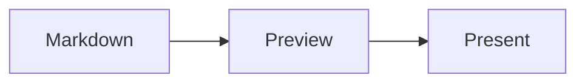

[English](README.md) | [中文](README.zh-CN.md) | [日本語](README.ja.md)

# Markdown Live Preview

[](https://marketplace.visualstudio.com/items?itemName=baryon.baryon-markdown-live-preview) [Install from VS Marketplace](https://marketplace.visualstudio.com/items?itemName=baryon.baryon-markdown-live-preview)

A modern VS Code extension for previewing Markdown — built for the AI era, where documents are generated first and read second.

> Preview-first. Because in the age of AI, you read more Markdown than you write.

## Screenshots

| Image Formats | MDX Support |
|:---:|:---:|
|  |  |
| **Marp Presentations** | **ASCII Mermaid** |
|  |  |
| **Recharts** | |
|  | |

## Why This Extension

AI tools like Claude, ChatGPT, and Copilot generate Markdown at scale — technical docs, reports, slide decks, research notes. The bottleneck is no longer writing; it's reviewing and presenting what was written. Markdown Live Preview is designed around this reality: open a file, see it rendered, navigate it, present it.

This project is a ground-up rewrite inspired by [Markdown Preview Enhanced](https://shd101wyy.github.io/markdown-preview-enhanced). We kept the ideas that matter — diagrams, math, TOC, presentations, code execution — and rebuilt the rendering engine for speed and simplicity.

## Features

### Three View Modes

Switch between modes from the editor title bar, command palette, or right-click menu:

| Mode | Shortcut | Description |
|------|----------|-------------|
| **Preview** | <kbd>Cmd+Shift+V</kbd> | Full-window rendered preview |
| **Side-by-Side** | <kbd>Cmd+K V</kbd> | Editor + preview with scroll sync |
| **Edit** | — | Editor only |

Default open mode is configurable: `edit`, `preview`, or `side-by-side`.

### Diagrams

#### Mermaid — Powered by [Beautiful Mermaid](https://agents.craft.do/mermaid)

Render flowcharts, sequence diagrams, Gantt charts, and more with curated visual themes:

````markdown

````

15 built-in mermaid themes: `github-light`, `github-dark`, `tokyo-night`, `catppuccin-mocha`, `dracula`, `nord`, `solarized-light`, and more. An ASCII rendering mode is also available for terminal-friendly output.

#### Kroki — 20+ Diagram Languages

Use `{kroki=true}` to render diagrams via the [Kroki](https://kroki.io) API:

````markdown
```plantuml {kroki=true}
Alice -> Bob: Hello
Bob --> Alice: Hi
```
````

Supported languages: PlantUML, GraphViz/DOT, D2, Ditaa, BlockDiag, Mermaid, Nomnoml, Pikchr, Excalidraw, SVGBob, Structurizr, ERD, DBML, TikZ, WireViz, and more.

#### Recharts — React Charts

Render interactive charts using [Recharts](https://recharts.org) v3 with JSX-like syntax:

````markdown
```recharts
<LineChart width={500} height={300} data={[
  { name: 'Jan', value: 400 },
  { name: 'Feb', value: 300 },
  { name: 'Mar', value: 600 }
]}>
  <XAxis dataKey="name" />
  <YAxis />
  <Line type="monotone" dataKey="value" stroke="#8884d8" />
</LineChart>
```
````

Supported chart types: `LineChart`, `BarChart`, `AreaChart`, `PieChart`, `ComposedChart`, `ScatterChart`, `RadarChart`. Common components like `XAxis`, `YAxis`, `CartesianGrid`, `Tooltip`, `Legend` are all supported.

#### Also Built-in

- **WaveDrom** — digital timing diagrams
- **Viz/DOT** — GraphViz diagrams (client-side)
- **Vega / Vega-Lite** — data visualizations

### MDX Support

`.mdx` files get full JSX expression evaluation and rendering. Inline expressions, exported variables, JSX styled blocks, conditional rendering, and `.map()` iterations are all processed before the Markdown engine — so they render as real content, not raw text.

```mdx
export const features = ['Mermaid', 'KaTeX', 'Marp', 'Shiki']

The year is {new Date().getFullYear()} and {1 + 2 + 3} is six.

<div style={{padding: '16px', background: '#f0f4ff', borderRadius: '8px'}}>
  <strong>Styled JSX</strong> blocks render as native HTML.
</div>

{features.map((f, i) => (
  <tr key={i}><td>{i + 1}</td><td>{f}</td></tr>
))}

export const showAdvanced = true
{showAdvanced && (<div>Conditionally rendered content.</div>)}
```

Supported: `export const/let/var`, inline `{expressions}`, `style={{...}}` / `className` conversion, `.map()` iterations, `&&` / ternary conditionals, and multi-line JSX blocks. Code blocks, KaTeX math, Mermaid diagrams, and Recharts charts inside `.mdx` files are all preserved and rendered normally.

### Math

KaTeX (default) or MathJax for rendering LaTeX math expressions:

```markdown
Inline: $E = mc^2$

Block:
$$
\int_{-\infty}^{\infty} e^{-x^2} dx = \sqrt{\pi}
$$
```

Delimiters are customizable. Both `$...$` / `$$...$$` and `\(...\)` / `\[...\]` are supported out of the box.

### Presentations — Marp

Write slide decks in Markdown with [Marp](https://marp.app). Add `marp: true` to front matter and use `---` to separate slides:

```markdown
---
marp: true
theme: default
paginate: true
---

# Slide 1

Content here

---

# Slide 2

More content
```

Front matter keys `slideshow` and `presentation` are also recognized for compatibility.

The preview includes a **Play** button for fullscreen presentation mode with keyboard and mouse navigation.

### Table of Contents

#### Inline TOC

Write `[TOC]` anywhere in your document to insert a rendered table of contents:

```markdown
[TOC]

## Introduction
## Getting Started
## API Reference
```

#### Sidebar TOC

A collapsible sidebar TOC is available via the preview context menu. Toggle with <kbd>Esc</kbd>.

#### TOC Configuration

Control depth and ordering via front matter:

```yaml
---
toc:
  depth_from: 2
  depth_to: 4
  ordered: true
---
```

Exclude headings from the TOC:

```markdown
## Internal Notes {ignore=true}
```

### File Imports

Import external files with `@import`:

```markdown
@import "diagram.mermaid"
@import "data.csv"
@import "styles.css"
@import "photo.png" {width=300}
@import "chapter2.md"
@import "code.py" {code_block=true}
```

Supported: Markdown, images (jpg/png/svg/gif/webp/bmp), CSV (rendered as tables), CSS/LESS, JavaScript, HTML, Mermaid, and any text file (as code blocks). Options include `line_begin`, `line_end`, `hide`, `width`, `height`, and more.

### Code Chunks

Execute code blocks directly in the preview (opt-in, disabled by default for security):

````markdown
```python {cmd=true}
import math
print(f"Pi = {math.pi:.10f}")
```
````

30+ languages supported including Python, JavaScript/TypeScript, Go, Rust, C/C++, Ruby, Bash, R, and LaTeX. Features include:

- Piped stdin, command-line arguments
- Output as text, HTML, Markdown, or PNG
- Python matplotlib support with inline image rendering
- LaTeX compilation with configurable engines (pdflatex/xelatex/lualatex)
- Chunk continuation and cross-referencing via `id` and `continue`

### Syntax Highlighting

[Shiki](https://shiki.matsu.io)-based syntax highlighting with 12 themes: `github-dark`, `github-light`, `monokai`, `one-dark-pro`, `dracula`, `nord`, `material-theme-darker`, `solarized-dark`, `vitesse-dark`, and more. Set to `auto` to match the preview theme.

### Preview Themes

13 beautiful preview themes, each with light and dark variants. Switch themes instantly via the right-click context menu:

| Light-first | Dark-first |
|-------------|------------|
| **GitHub** — Classic GitHub style (default) | **Dracula** — Purple/cyan accents |
| **Obsidian** — Purple accent, inspired by Obsidian notes | **Nord** — Arctic, cool blue palette |
| **Vue** — Green accent, inspired by Vue.js docs | **One Dark** — Atom editor colors |
| **Lark** — Clean blue, inspired by Feishu/Lark docs | **Tokyo Night** — Soft purple/lavender |
| **Smartblue** — Vivid blue accent | **Monokai** — Classic dark editor |
| **Medium** — Warm serif reading experience | **Solarized** — Precision colors |
| **Gothic** — Minimal and elegant | |

Color scheme (light/dark/system) can be toggled independently from the theme via the context menu or VS Code settings.

### Quick Actions (Hover Panels)

Hover over code blocks or diagrams to reveal quick action buttons:

#### Code Blocks
- **Copy** — Copy code to clipboard (line numbers excluded)

#### Diagrams (Mermaid, GraphViz, Vega, WaveDrom)
- **Code** — Copy diagram source code
- **SVG** — Copy as SVG to clipboard
- **PNG** — Copy as PNG image to clipboard

#### Mermaid Diagrams (Additional)
- **Theme Selector** — Switch between 15 Mermaid themes on the fly
- **ASCII Toggle** — Switch between SVG and ASCII rendering mode

### Copy for Lark (飞书)

Right-click in the preview and select **"Copy for Lark (飞书)"** to copy content optimized for pasting into Lark/Feishu documents:

- Code blocks converted to clean formatted text
- Diagrams converted to PNG images for better compatibility
- Tables, blockquotes, and task lists properly styled
- All formatting preserved for seamless paste

### Obsidian Compatibility

Native support for Obsidian-flavored Markdown syntax:

- **Highlights** — `==highlighted text==` renders as <mark>highlighted text</mark>
- **Comments** — `%%hidden comment%%` stripped from rendered output
- **Callouts** — `> [!note]`, `> [!tip]`, `> [!warning]` and 15 styled callout types with icons (note, info, tip, success, warning, caution, important, danger, failure, question, bug, example, quote, abstract, todo)
- **Image Embeds** — `![[image.png]]` Obsidian-style image embedding with optional alt text `![[image.png|alt text]]`
- **Heading Anchors** — `[[page#heading]]` wiki link anchors with automatic slug generation
- **Custom Heading IDs** — `## My Heading {#custom-id}` for custom anchor targets

```markdown
> [!tip] Pro Tip
> Callouts support **markdown** formatting inside.

==This is highlighted== and %%this is hidden%%.
```

### Additional Features

- **Wiki Links** — `[[page]]` and `[[page|display text]]` syntax with configurable case transformation
- **Emoji** — `:smile:` syntax via markdown-it-emoji
- **Footnotes** — `[^1]` reference-style footnotes
- **Subscript / Superscript** — `H~2~O` and `x^2^`
- **Task Lists** — `- [x] Done` checkboxes
- **Linkify** — auto-detect URLs
- **Scroll Sync** — bidirectional scroll synchronization between editor and preview
- **Live Update** — real-time preview with configurable debounce
- **Front Matter** — render as table, code block, or hide
- **Custom CSS** — apply your own styles to the preview
- **Image Helper** — paste and manage images
- **Zen Mode** — hide UI elements in preview until hover

## Supported File Types

`.md`, `.markdown`, `.mdown`, `.mkdn`, `.mkd`, `.rmd`, `.qmd`, `.mdx`

## Keyboard Shortcuts

> <kbd>Cmd</kbd> on macOS, <kbd>Ctrl</kbd> on Windows/Linux.

| Shortcut | Action |
|----------|--------|
| <kbd>Cmd+K V</kbd> | Open preview to the side |
| <kbd>Cmd+Shift+V</kbd> | Open preview |
| <kbd>Ctrl+Shift+S</kbd> | Sync preview / Sync source |
| <kbd>Shift+Enter</kbd> | Run code chunk |
| <kbd>Cmd+Shift+Enter</kbd> | Run all code chunks |
| <kbd>Esc</kbd> | Toggle sidebar TOC |

## Configuration

All settings are under the `markdown-live-preview` namespace. Key options:

| Setting | Default | Description |
|---------|---------|-------------|
| `markdownOpenMode` | `side-by-side` | Default mode when opening Markdown files |
| `previewTheme` | `github` | Preview theme (13 themes: github, obsidian, vue, lark, smartblue, medium, gothic, dracula, nord, one-dark, tokyo-night, monokai, solarized) |
| `codeBlockTheme` | `auto` | Syntax highlighting theme |
| `mermaidTheme` | `github-light` | Mermaid diagram theme |
| `mathRenderingOption` | `KaTeX` | Math rendering engine |
| `scrollSync` | `true` | Bidirectional scroll sync |
| `liveUpdate` | `true` | Real-time preview updates |
| `breakOnSingleNewLine` | `true` | GFM-style line breaks |
| `enableScriptExecution` | `false` | Code chunk execution |
| `enableWikiLinkSyntax` | `true` | Wiki link support |
| `enableEmojiSyntax` | `true` | Emoji support |

See the full settings list in VS Code: **Settings > Extensions > Markdown Live Preview**.

## Acknowledgments

This project draws heavily from the ideas and design of [Markdown Preview Enhanced](https://shd101wyy.github.io/markdown-preview-enhanced) by Yiyi Wang. Mermaid diagrams are rendered using the [Beautiful Mermaid](https://agents.craft.do/mermaid) service. Presentation support is powered by [Marp](https://marp.app).

## Contributing

We welcome contributions — with one rule: **all code submissions must be AI-generated.** We believe AI-assisted development produces higher-quality, more consistent code. Use tools like Claude, ChatGPT, Copilot, or any AI coding assistant to write your contributions. Human-written code will not be accepted.

## License

[MIT](LICENSE.md)
