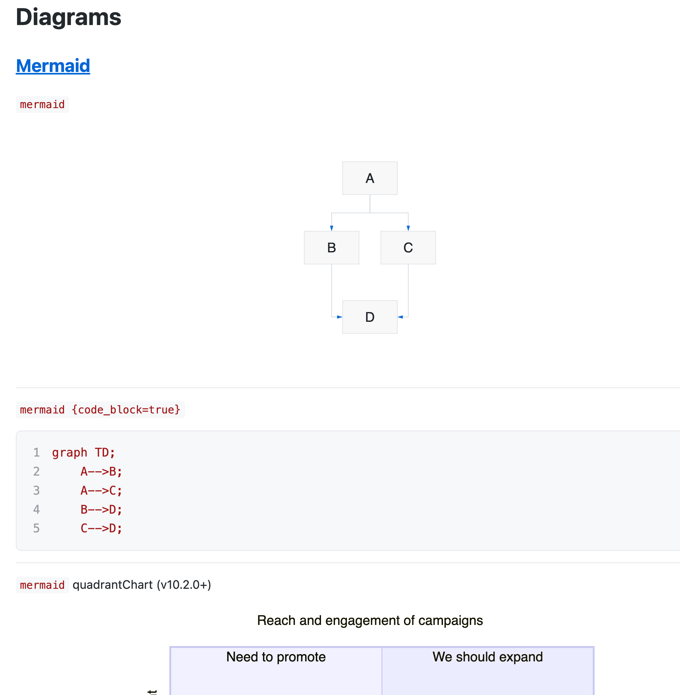
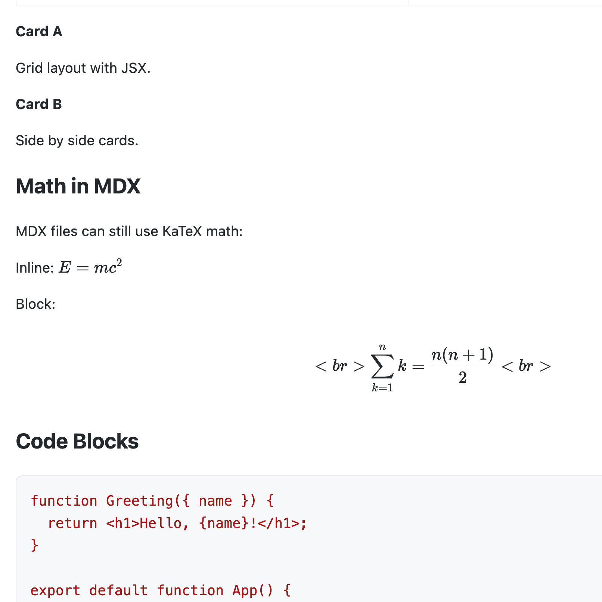
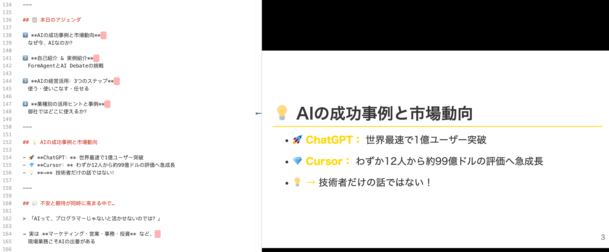
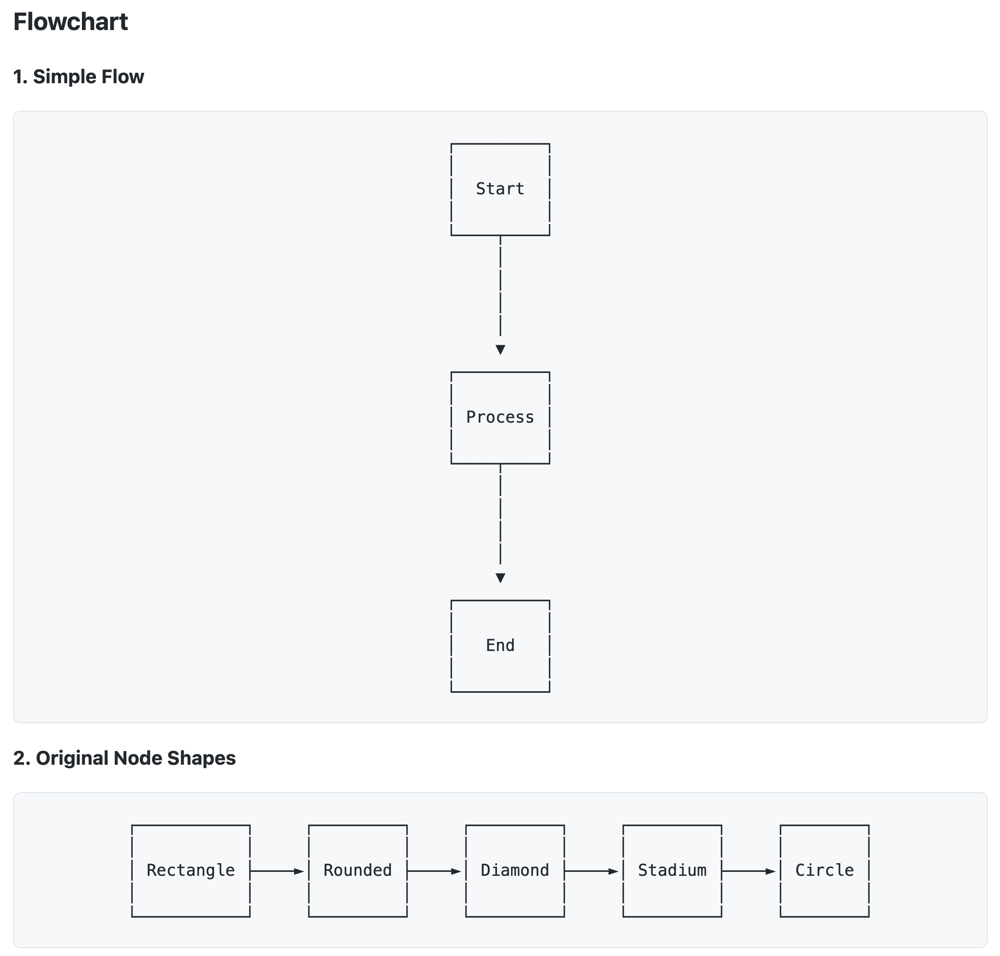

[English](README.md) | [中文](README.zh-CN.md) | [日本語](README.ja.md)

# Markdown Live Preview

[](https://marketplace.visualstudio.com/items?itemName=baryon.baryon-markdown-live-preview) [从 VS Marketplace 安装](https://marketplace.visualstudio.com/items?itemName=baryon.baryon-markdown-live-preview)

一款现代化的 VS Code Markdown 预览扩展 —— 为 AI 时代而生，文档先生成，再阅读。

> 预览优先。因为在 AI 时代，你阅读的 Markdown 远多于你编写的。

## 截图

| 多种图像格式 | MDX 支持 |
|:---:|:---:|
|  |  |
| **Marp 演示文稿** | **ASCII Mermaid** |
|  |  |
| **Recharts 图表** | |
|  | |

## 为什么选择这个扩展

Claude、ChatGPT、Copilot 等 AI 工具正在大规模生成 Markdown —— 技术文档、报告、演示文稿、研究笔记。瓶颈不再是写作，而是审阅和展示已生成的内容。Markdown Live Preview 正是围绕这一现实设计的：打开文件，即刻渲染，随时导航，随时演示。

本项目受 [Markdown Preview Enhanced](https://shd101wyy.github.io/markdown-preview-enhanced) 启发，从零开始重写。我们保留了核心功能 —— 图表、数学公式、目录、演示文稿、代码执行 —— 并重建了渲染引擎，追求速度与简洁。

## 功能特性

### 三种视图模式

通过编辑器标题栏、命令面板或右键菜单切换模式：

| 模式 | 快捷键 | 说明 |
|------|--------|------|
| **预览** | <kbd>Cmd+Shift+V</kbd> | 全窗口渲染预览 |
| **并排** | <kbd>Cmd+K V</kbd> | 编辑器 + 预览，滚动同步 |
| **编辑** | — | 仅编辑器 |

默认打开模式可配置：`edit`、`preview` 或 `side-by-side`。

### 图表

#### Mermaid —— 由 [Beautiful Mermaid](https://agents.craft.do/mermaid) 驱动

使用精心设计的视觉主题渲染流程图、时序图、甘特图等：

````markdown

````

15 个内置 Mermaid 主题：`github-light`、`github-dark`、`tokyo-night`、`catppuccin-mocha`、`dracula`、`nord`、`solarized-light` 等。还提供 ASCII 渲染模式，适用于终端输出。

#### Kroki —— 20+ 种图表语言

使用 `{kroki=true}` 通过 [Kroki](https://kroki.io) API 渲染图表：

````markdown
```plantuml {kroki=true}
Alice -> Bob: Hello
Bob --> Alice: Hi
```
````

支持的语言：PlantUML、GraphViz/DOT、D2、Ditaa、BlockDiag、Mermaid、Nomnoml、Pikchr、Excalidraw、SVGBob、Structurizr、ERD、DBML、TikZ、WireViz 等。

#### Recharts —— React 图表库

使用 [Recharts](https://recharts.org) v3 以类 JSX 语法渲染交互式图表：

````markdown
```recharts
<LineChart width={500} height={300} data={[
  { name: 'Jan', value: 400 },
  { name: 'Feb', value: 300 },
  { name: 'Mar', value: 600 }
]}>
  <XAxis dataKey="name" />
  <YAxis />
  <Line type="monotone" dataKey="value" stroke="#8884d8" />
</LineChart>
```
````

支持的图表类型：`LineChart`、`BarChart`、`AreaChart`、`PieChart`、`ComposedChart`、`ScatterChart`、`RadarChart`。常用组件如 `XAxis`、`YAxis`、`CartesianGrid`、`Tooltip`、`Legend` 均可使用。

#### 其他内置支持

- **WaveDrom** —— 数字时序图
- **Viz/DOT** —— GraphViz 图表（客户端渲染）
- **Vega / Vega-Lite** —— 数据可视化

### 数学公式

使用 KaTeX（默认）或 MathJax 渲染 LaTeX 数学表达式：

```markdown
行内公式：$E = mc^2$

块级公式：
$$
\int_{-\infty}^{\infty} e^{-x^2} dx = \sqrt{\pi}
$$
```

分隔符可自定义。开箱即用支持 `$...$` / `$$...$$` 和 `\(...\)` / `\[...\]`。

### 演示文稿 —— Marp

使用 [Marp](https://marp.app) 在 Markdown 中编写幻灯片。在 front matter 中添加 `marp: true`，使用 `---` 分隔幻灯片：

```markdown
---
marp: true
theme: default
paginate: true
---

# 幻灯片 1

内容

---

# 幻灯片 2

更多内容
```

兼容 `slideshow` 和 `presentation` front matter 关键字。

预览包含**播放**按钮，支持全屏演示模式，可使用键盘和鼠标导航。

### 目录

#### 内联目录

在文档任意位置写入 `[TOC]` 即可插入渲染的目录：

```markdown
[TOC]

## 简介
## 快速开始
## API 参考
```

#### 侧边栏目录

可通过预览右键菜单打开可折叠的侧边栏目录。使用 <kbd>Esc</kbd> 切换。

#### 目录配置

通过 front matter 控制深度和排序：

```yaml
---
toc:
  depth_from: 2
  depth_to: 4
  ordered: true
---
```

从目录中排除标题：

```markdown
## 内部笔记 {ignore=true}
```

### 文件导入

使用 `@import` 导入外部文件：

```markdown
@import "diagram.mermaid"
@import "data.csv"
@import "styles.css"
@import "photo.png" {width=300}
@import "chapter2.md"
@import "code.py" {code_block=true}
```

支持：Markdown、图片（jpg/png/svg/gif/webp/bmp）、CSV（渲染为表格）、CSS/LESS、JavaScript、HTML、Mermaid 及任何文本文件（作为代码块）。选项包括 `line_begin`、`line_end`、`hide`、`width`、`height` 等。

### 代码块执行

在预览中直接执行代码块（需手动开启，默认因安全原因禁用）：

````markdown
```python {cmd=true}
import math
print(f"Pi = {math.pi:.10f}")
```
````

支持 30+ 种语言，包括 Python、JavaScript/TypeScript、Go、Rust、C/C++、Ruby、Bash、R 和 LaTeX。功能包括：

- 管道标准输入、命令行参数
- 输出为文本、HTML、Markdown 或 PNG
- Python matplotlib 支持，内联图片渲染
- LaTeX 编译，可配置引擎（pdflatex/xelatex/lualatex）
- 代码块续接和交叉引用（通过 `id` 和 `continue`）

### 语法高亮

基于 [Shiki](https://shiki.matsu.io) 的语法高亮，提供 12 个主题：`github-dark`、`github-light`、`monokai`、`one-dark-pro`、`dracula`、`nord`、`material-theme-darker`、`solarized-dark`、`vitesse-dark` 等。设为 `auto` 可自动匹配预览主题。

### 预览主题

16 个预览主题：`github-light`、`github-dark`、`one-dark`、`one-light`、`solarized-dark`、`solarized-light`、`atom-dark`、`atom-light`、`atom-material`、`gothic`、`medium`、`monokai`、`newsprint`、`night`、`vue` 和 `none`。

配色方案可跟随所选主题、系统设置或编辑器的亮/暗模式。

### 快捷操作（悬停面板）

将鼠标悬停在代码块或图表上，即可显示快捷操作按钮：

#### 代码块
- **Copy** —— 复制代码到剪贴板（自动排除行号）

#### 图表（Mermaid、GraphViz、Vega、WaveDrom）
- **Code** —— 复制图表源代码
- **SVG** —— 复制为 SVG 到剪贴板
- **PNG** —— 复制为 PNG 图片到剪贴板

#### Mermaid 图表（额外功能）
- **主题选择器** —— 实时切换 15 种 Mermaid 主题
- **ASCII 切换** —— 在 SVG 和 ASCII 渲染模式间切换

### 复制到飞书

在预览中右键选择 **"Copy for Lark (飞书)"**，可复制为飞书文档优化的格式：

- 代码块转换为干净的格式化文本
- 图表转换为 PNG 图片，兼容性更好
- 表格、引用块、任务列表保持正确样式
- 所有格式完整保留，粘贴即用

### 其他功能

- **Wiki 链接** —— `[[page]]` 和 `[[page|显示文本]]` 语法，支持可配置的大小写转换
- **Emoji** —— `:smile:` 语法，基于 markdown-it-emoji
- **脚注** —— `[^1]` 引用式脚注
- **上下标** —— `H~2~O` 和 `x^2^`
- **任务列表** —— `- [x] 已完成` 复选框
- **自动链接** —— 自动检测 URL
- **滚动同步** —— 编辑器与预览之间的双向滚动同步
- **实时更新** —— 实时预览，可配置防抖时间
- **Front Matter** —— 渲染为表格、代码块或隐藏
- **自定义 CSS** —— 为预览应用自定义样式
- **图片助手** —— 粘贴和管理图片
- **禅模式** —— 悬停前隐藏预览中的 UI 元素

## 支持的文件类型

`.md`、`.markdown`、`.mdown`、`.mkdn`、`.mkd`、`.rmd`、`.qmd`、`.mdx`

## 键盘快捷键

> macOS 使用 <kbd>Cmd</kbd>，Windows/Linux 使用 <kbd>Ctrl</kbd>。

| 快捷键 | 操作 |
|--------|------|
| <kbd>Cmd+K V</kbd> | 在侧边打开预览 |
| <kbd>Cmd+Shift+V</kbd> | 打开预览 |
| <kbd>Ctrl+Shift+S</kbd> | 同步预览 / 同步源文件 |
| <kbd>Shift+Enter</kbd> | 运行代码块 |
| <kbd>Cmd+Shift+Enter</kbd> | 运行所有代码块 |
| <kbd>Esc</kbd> | 切换侧边栏目录 |

## 配置

所有设置位于 `markdown-live-preview` 命名空间下。主要选项：

| 设置 | 默认值 | 说明 |
|------|--------|------|
| `markdownOpenMode` | `side-by-side` | 打开 Markdown 文件的默认模式 |
| `previewTheme` | `github-light.css` | 预览主题 |
| `codeBlockTheme` | `auto` | 语法高亮主题 |
| `mermaidTheme` | `github-light` | Mermaid 图表主题 |
| `mathRenderingOption` | `KaTeX` | 数学公式渲染引擎 |
| `scrollSync` | `true` | 双向滚动同步 |
| `liveUpdate` | `true` | 实时预览更新 |
| `breakOnSingleNewLine` | `true` | GFM 风格换行 |
| `enableScriptExecution` | `false` | 代码块执行 |
| `enableWikiLinkSyntax` | `true` | Wiki 链接支持 |
| `enableEmojiSyntax` | `true` | Emoji 支持 |

完整设置列表请在 VS Code 中查看：**设置 > 扩展 > Markdown Live Preview**。

## 贡献

我们欢迎贡献，但有一条规则：**所有代码提交必须由 AI 生成。** 我们相信 AI 辅助开发能产出更高质量、更一致的代码。请使用 Claude、ChatGPT、Copilot 或任何 AI 编程助手来编写你的贡献。人工手写的代码将不被接受。

## 致谢

本项目深受 Yiyi Wang 的 [Markdown Preview Enhanced](https://shd101wyy.github.io/markdown-preview-enhanced) 的思想和设计启发。Mermaid 图表使用 [Beautiful Mermaid](https://agents.craft.do/mermaid) 服务渲染。演示文稿功能由 [Marp](https://marp.app) 提供支持。

## 许可证

[MIT](LICENSE.md)
