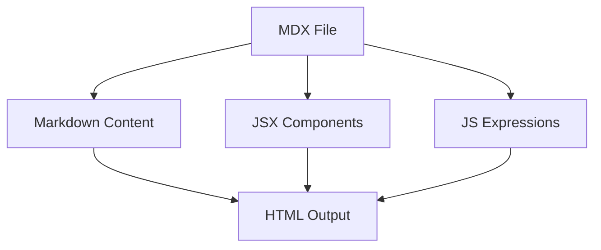

# MDX Features Demo

MDX lets you use JSX in your markdown content, combining the readability of Markdown with the power of components.

## Inline Expressions

The current year is {new Date().getFullYear()}. MDX supports JavaScript expressions wrapped in curly braces: {1 + 2 + 3}.

## JSX Components

<div style={{padding: '16px', background: '#f0f4ff', borderRadius: '8px', border: '1px solid #c0d0ff'}}>
  <h3 style={{margin: 0, color: '#1a3a8a'}}>Info Box</h3>
  <p>This is a styled JSX block rendered directly in MDX.</p>
</div>

<details>
  <summary>Click to expand</summary>

  This is hidden content inside a native HTML `<details>` element.

  - Works with Markdown inside
  - **Bold** and *italic* too
  - Even `inline code`
</details>

## Export / Variables

export const version = '0.9.0'
export const features = ['Mermaid', 'KaTeX', 'Marp', 'Shiki', 'Code Chunks']

<table>
  <thead>
    <tr><th>#</th><th>Feature</th></tr>
  </thead>
  <tbody>
    {features.map((f, i) => (
      <tr key={i}><td>{i + 1}</td><td>{f}</td></tr>
    ))}
  </tbody>
</table>

## Mixing Markdown and JSX

Regular markdown works alongside JSX:

| Syntax    | Support |
|-----------|---------|
| **Bold**  | Yes     |
| *Italic*  | Yes     |
| `Code`    | Yes     |
| ~~Strike~~| Yes     |

<div style={{display: 'grid', gridTemplateColumns: '1fr 1fr', gap: '12px', margin: '16px 0'}}>
  <div style={{padding: '12px', background: '#e8f5e9', borderRadius: '6px'}}>
    <strong>Card A</strong>
    <p>Grid layout with JSX.</p>
  </div>
  <div style={{padding: '12px', background: '#fff3e0', borderRadius: '6px'}}>
    <strong>Card B</strong>
    <p>Side by side cards.</p>
  </div>
</div>

## Math in MDX

MDX files can still use KaTeX math:

Inline: $E = mc^2$

Block:

$$
\sum_{k=1}^{n} k = \frac{n(n+1)}{2}
$$

## Code Blocks

```jsx
function Greeting({ name }) {
  return <h1>Hello, {name}!</h1>;
}

export default function App() {
  return (
    <div>
      <Greeting name="MDX" />
      <p>Components in markdown.</p>
    </div>
  );
}
```

```typescript
interface MDXProps {
  components?: Record<string, React.ComponentType>;
  children?: React.ReactNode;
}

const MDXProvider: React.FC<MDXProps> = ({ components, children }) => {
  return <MDXContext.Provider value={components}>{children}</MDXContext.Provider>;
};
```

## Recharts

MDX supports Recharts for data visualization:

```recharts
<LineChart width={500} height={300} data={[
  { name: 'Jan', sales: 400, profit: 240 },
  { name: 'Feb', sales: 300, profit: 139 },
  { name: 'Mar', sales: 200, profit: 980 },
  { name: 'Apr', sales: 278, profit: 390 },
  { name: 'May', sales: 189, profit: 480 },
  { name: 'Jun', sales: 239, profit: 380 }
]}>
  <CartesianGrid strokeDasharray="3 3" />
  <XAxis dataKey="name" />
  <YAxis />
  <Tooltip />
  <Legend />
  <Line type="monotone" dataKey="sales" stroke="#8884d8" />
  <Line type="monotone" dataKey="profit" stroke="#82ca9d" />
</LineChart>
```

```recharts
<BarChart width={500} height={300} data={[
  { name: 'React', value: 85 },
  { name: 'Vue', value: 75 },
  { name: 'Angular', value: 60 },
  { name: 'Svelte', value: 45 },
  { name: 'Solid', value: 30 }
]}>
  <CartesianGrid strokeDasharray="3 3" />
  <XAxis dataKey="name" />
  <YAxis />
  <Tooltip />
  <Bar dataKey="value" fill="#8884d8" />
</BarChart>
```

```recharts
<PieChart width={400} height={300}>
  <Pie
    data={[
      { name: 'Desktop', value: 400 },
      { name: 'Mobile', value: 300 },
      { name: 'Tablet', value: 200 },
      { name: 'Other', value: 100 }
    ]}
    cx="50%"
    cy="50%"
    outerRadius={100}
    fill="#8884d8"
    dataKey="value"
    label
  />
  <Tooltip />
  <Legend />
</PieChart>
```

```recharts
<AreaChart width={500} height={300} data={[
  { month: 'Jan', uv: 4000, pv: 2400 },
  { month: 'Feb', uv: 3000, pv: 1398 },
  { month: 'Mar', uv: 2000, pv: 9800 },
  { month: 'Apr', uv: 2780, pv: 3908 },
  { month: 'May', uv: 1890, pv: 4800 },
  { month: 'Jun', uv: 2390, pv: 3800 }
]}>
  <CartesianGrid strokeDasharray="3 3" />
  <XAxis dataKey="month" />
  <YAxis />
  <Tooltip />
  <Area type="monotone" dataKey="uv" stackId="1" stroke="#8884d8" fill="#8884d8" />
  <Area type="monotone" dataKey="pv" stackId="1" stroke="#82ca9d" fill="#82ca9d" />
</AreaChart>
```

## Diagrams

Mermaid diagrams work in MDX too:



## Custom HTML Elements

<figure style={{textAlign: 'center', margin: '24px 0'}}>
  <blockquote style={{fontSize: '1.2em', fontStyle: 'italic', color: '#555', borderLeft: '4px solid #3b82f6', paddingLeft: '16px', margin: 0}}>
    MDX is markdown for the component era.
  </blockquote>
  <figcaption style={{marginTop: '8px', color: '#888'}}>— MDX Documentation</figcaption>
</figure>

## Conditional Rendering

export const showAdvanced = true

{showAdvanced && (
  <div style={{padding: '12px', background: '#fce4ec', borderRadius: '6px', border: '1px solid #f48fb1'}}>
    <strong>Advanced Section</strong>
    <p>This block is conditionally rendered based on the <code>showAdvanced</code> variable.</p>
  </div>
)}

## Task List

- [x] Markdown basics
- [x] JSX components
- [x] JavaScript expressions
- [x] Math rendering
- [x] Mermaid diagrams
- [ ] Custom component library
- [ ] MDX plugins

## Footnotes

MDX supports standard markdown footnotes[^1] and other extensions[^2].

[^1]: Footnotes work the same as in regular markdown.
[^2]: Including emoji :rocket: and wiki links [[Home]].
