# Mermaid Diagram Examples

Examples from [Beautiful Mermaid](https://agents.craft.do/mermaid) — 69 diagrams covering all supported types.

---

## Flowchart

### 1. Simple Flow

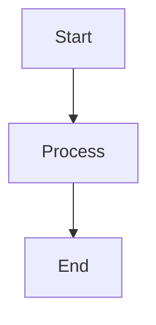

### 2. Original Node Shapes

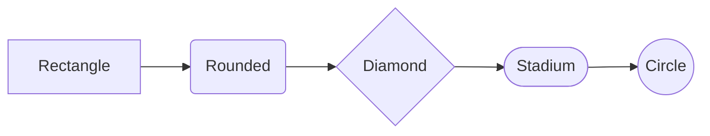

### 3. Batch 1 Shapes

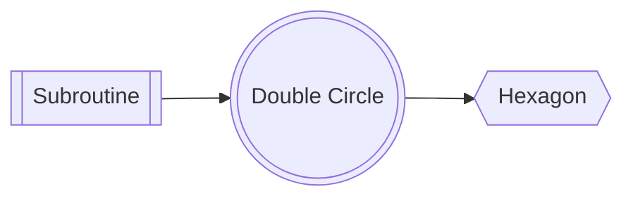

### 4. Batch 2 Shapes

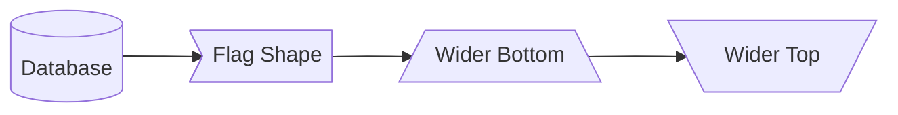

### 5. All 12 Flowchart Shapes

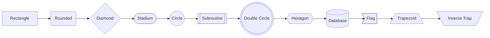

### 6. All Edge Styles

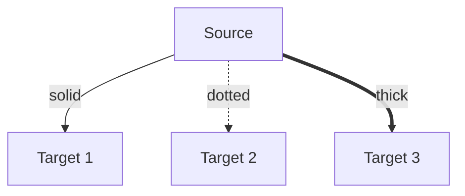

### 7. No-Arrow Edges

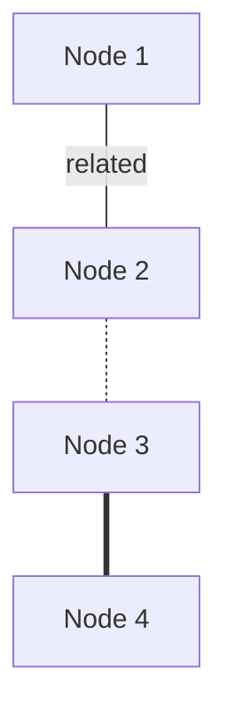

### 8. Bidirectional Arrows

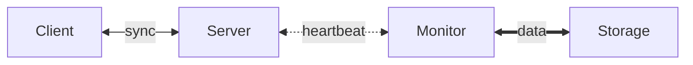

### 9. Parallel Links (&)

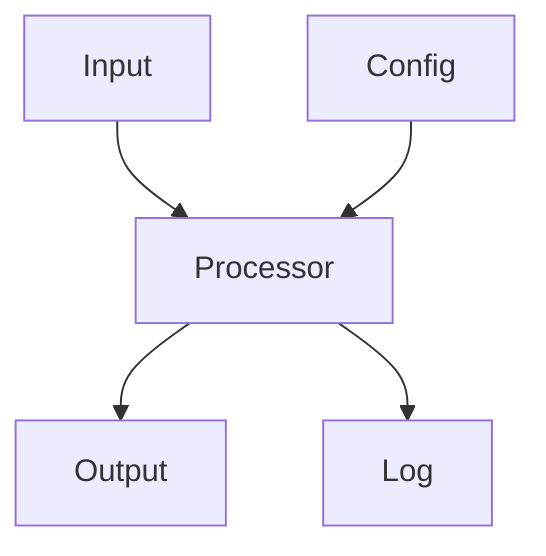

### 10. Chained Edges

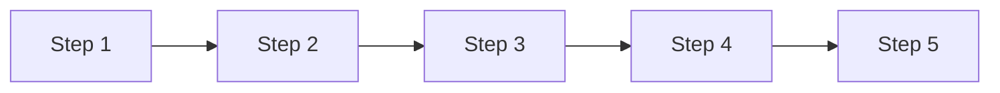

### 11. Direction: Left-Right (LR)

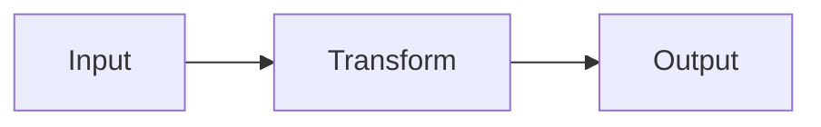

### 12. Direction: Bottom-Top (BT)

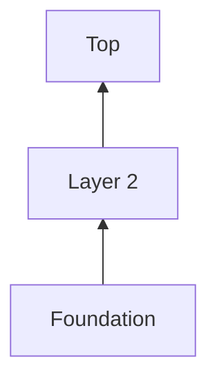

### 13. Subgraphs

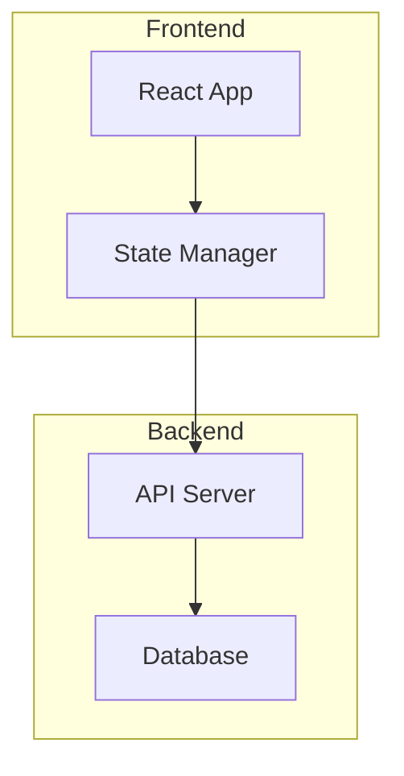

### 14. Nested Subgraphs

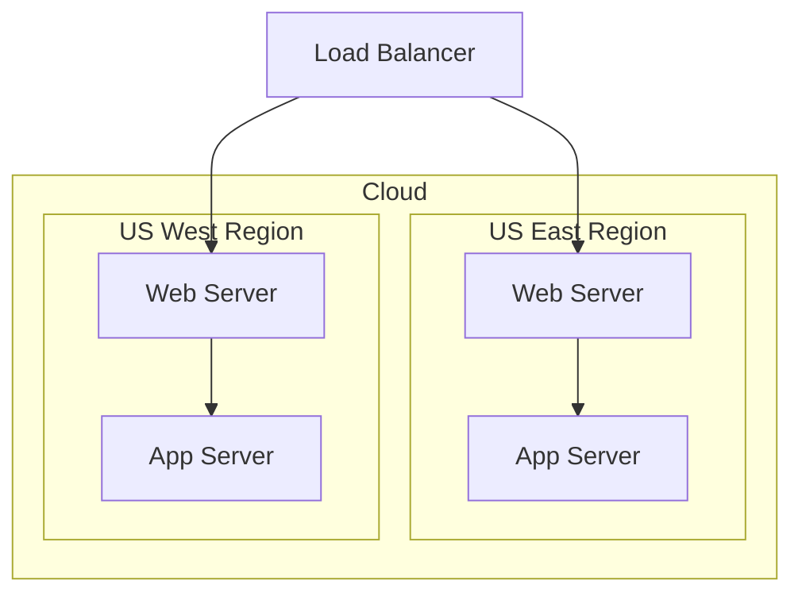

### 15. Subgraph Direction Override

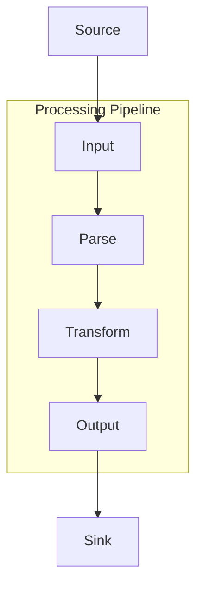

### 16. Class Shorthand (:::)

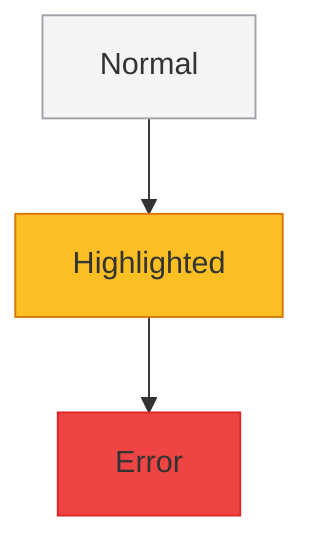

### 17. Inline Style Overrides

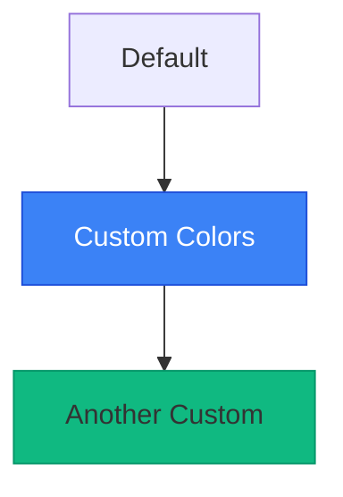

### 18. CI/CD Pipeline

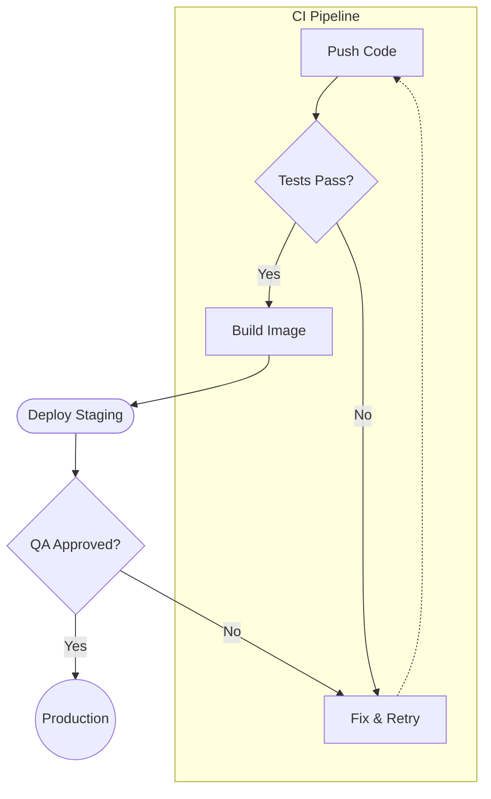

### 19. System Architecture

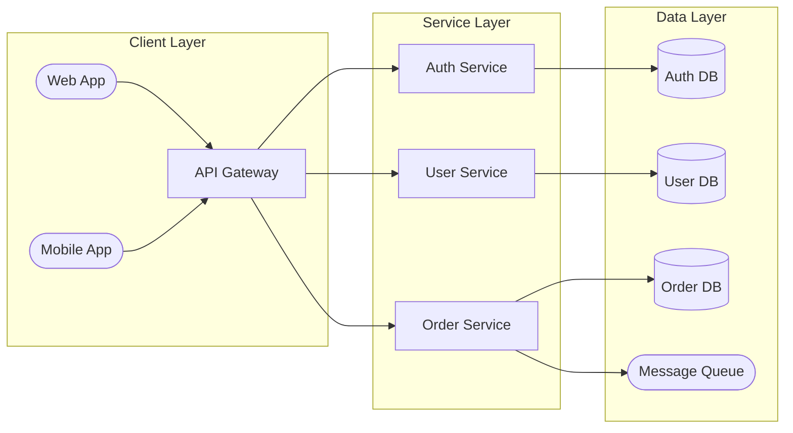

### 20. Decision Tree

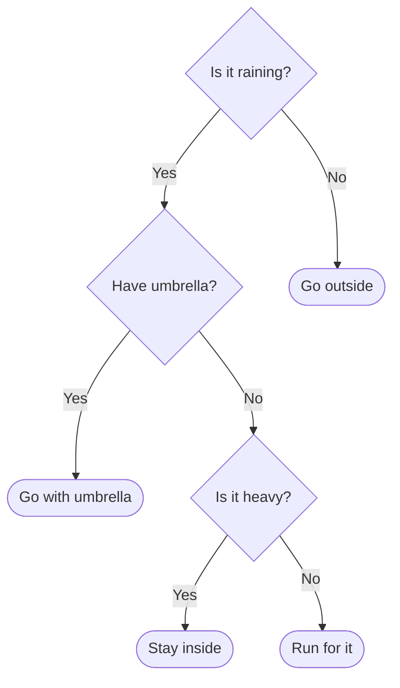

### 21. Git Branching Workflow

```mermaid
graph LR
  A[main] --> B[develop]
  B --> C[feature/auth]
  B --> D[feature/ui]
  C --> E{PR Review}
  D --> E
  E -->|approved| B
  B --> F[release/1.0]
  F --> G{Tests?}
  G -->|pass| A
  G -->|fail| F
```

---

## State Diagram

### 22. Basic State Diagram

```mermaid
stateDiagram-v2
  [*] --> Idle
  Idle --> Active : start
  Active --> Idle : cancel
  Active --> Done : complete
  Done --> [*]
```

### 23. Composite States

```mermaid
stateDiagram-v2
  [*] --> Idle
  Idle --> Processing : submit
  state Processing {
    parse --> validate
    validate --> execute
  }
  Processing --> Complete : done
  Processing --> Error : fail
  Error --> Idle : retry
  Complete --> [*]
```

### 24. Connection Lifecycle

```mermaid
stateDiagram-v2
  [*] --> Closed
  Closed --> Connecting : connect
  Connecting --> Connected : success
  Connecting --> Closed : timeout
  Connected --> Disconnecting : close
  Connected --> Reconnecting : error
  Reconnecting --> Connected : success
  Reconnecting --> Closed : max_retries
  Disconnecting --> Closed : done
  Closed --> [*]
```

---

## Sequence Diagram

### 25. Basic Messages

```mermaid
sequenceDiagram
  Alice->>Bob: Hello Bob!
  Bob-->>Alice: Hi Alice!
```

### 26. Participant Aliases

```mermaid
sequenceDiagram
  participant A as Alice
  participant B as Bob
  participant C as Charlie
  A->>B: Hello
  B->>C: Forward
  C-->>A: Reply
```

### 27. Actor Stick Figures

```mermaid
sequenceDiagram
  actor U as User
  participant S as System
  participant DB as Database
  U->>S: Click button
  S->>DB: Query
  DB-->>S: Results
  S-->>U: Display
```

### 28. Arrow Types

```mermaid
sequenceDiagram
  A->>B: Solid arrow (sync)
  B-->>A: Dashed arrow (return)
  A-)B: Open arrow (async)
  B--)A: Open dashed arrow
```

### 29. Activation Boxes

```mermaid
sequenceDiagram
  participant C as Client
  participant S as Server
  C->>+S: Request
  S->>+S: Process
  S->>-S: Done
  S-->>-C: Response
```

### 30. Self-Messages

```mermaid
sequenceDiagram
  participant S as Server
  S->>S: Internal process
  S->>S: Validate
  S-->>S: Log
```

### 31. Loop Block

```mermaid
sequenceDiagram
  participant C as Client
  participant S as Server
  C->>S: Connect
  loop Every 30s
    C->>S: Heartbeat
    S-->>C: Ack
  end
  C->>S: Disconnect
```

### 32. Alt/Else Block

```mermaid
sequenceDiagram
  participant C as Client
  participant S as Server
  C->>S: Login
  alt Valid credentials
    S-->>C: 200 OK
  else Invalid
    S-->>C: 401 Unauthorized
  else Account locked
    S-->>C: 403 Forbidden
  end
```

### 33. Opt Block

```mermaid
sequenceDiagram
  participant A as App
  participant C as Cache
  participant DB as Database
  A->>C: Get data
  C-->>A: Cache miss
  opt Cache miss
    A->>DB: Query
    DB-->>A: Results
    A->>C: Store in cache
  end
```

### 34. Par Block

```mermaid
sequenceDiagram
  participant C as Client
  participant A as AuthService
  participant U as UserService
  participant O as OrderService
  C->>A: Authenticate
  par Fetch user data
    A->>U: Get profile
  and Fetch orders
    A->>O: Get orders
  end
  A-->>C: Combined response
```

### 35. Critical Block

```mermaid
sequenceDiagram
  participant A as App
  participant DB as Database
  A->>DB: BEGIN
  critical Transaction
    A->>DB: UPDATE accounts
    A->>DB: INSERT log
  end
  A->>DB: COMMIT
```

### 36. Notes (Right/Left/Over)

```mermaid
sequenceDiagram
  participant A as Alice
  participant B as Bob
  Note left of A: Alice prepares
  A->>B: Hello
  Note right of B: Bob thinks
  B-->>A: Reply
  Note over A,B: Conversation complete
```

### 37. OAuth 2.0 Flow

```mermaid
sequenceDiagram
  actor U as User
  participant App as Client App
  participant Auth as Auth Server
  participant API as Resource API
  U->>App: Click Login
  App->>Auth: Authorization request
  Auth->>U: Login page
  U->>Auth: Credentials
  Auth-->>App: Authorization code
  App->>Auth: Exchange code for token
  Auth-->>App: Access token
  App->>API: Request + token
  API-->>App: Protected resource
  App-->>U: Display data
```

### 38. Database Transaction

```mermaid
sequenceDiagram
  participant C as Client
  participant S as Server
  participant DB as Database
  C->>S: POST /transfer
  S->>DB: BEGIN
  S->>DB: Debit account A
  alt Success
    S->>DB: Credit account B
    S->>DB: INSERT audit_log
    S->>DB: COMMIT
    S-->>C: 200 OK
  else Insufficient funds
    S->>DB: ROLLBACK
    S-->>C: 400 Bad Request
  end
```

### 39. Microservice Orchestration

```mermaid
sequenceDiagram
  participant G as Gateway
  participant A as Auth
  participant U as Users
  participant O as Orders
  participant N as Notify
  G->>A: Validate token
  A-->>G: Valid
  par Fetch data
    G->>U: Get user
    U-->>G: User data
  and
    G->>O: Get orders
    O-->>G: Order list
  end
  G->>N: Send notification
  N-->>G: Queued
  Note over G: Aggregate response
```

---

## Class Diagram

### 40. Basic Class

```mermaid
classDiagram
  class Animal {
    +String name
    +int age
    +eat() void
    +sleep() void
  }
```

### 41. Visibility Markers

```mermaid
classDiagram
  class User {
    +String name
    -String password
    #int internalId
    ~String packageField
    +login() bool
    -hashPassword() String
    #validate() void
    ~notify() void
  }
```

### 42. Interface Annotation

```mermaid
classDiagram
  class Serializable {
    <<interface>>
    +serialize() String
    +deserialize(data) void
  }
```

### 43. Abstract Annotation

```mermaid
classDiagram
  class Shape {
    <<abstract>>
    +String color
    +area() double
    +draw() void
  }
```

### 44. Enum Annotation

```mermaid
classDiagram
  class Status {
    <<enumeration>>
    ACTIVE
    INACTIVE
    PENDING
    DELETED
  }
```

### 45. Inheritance (<|--)

```mermaid
classDiagram
  class Animal {
    +String name
    +eat() void
  }
  class Dog {
    +String breed
    +bark() void
  }
  class Cat {
    +bool isIndoor
    +meow() void
  }
  Animal <|-- Dog
  Animal <|-- Cat
```

### 46. Composition (\*--)

```mermaid
classDiagram
  class Car {
    +String model
    +start() void
  }
  class Engine {
    +int horsepower
    +rev() void
  }
  Car *-- Engine
```

### 47. Aggregation (o--)

```mermaid
classDiagram
  class University {
    +String name
  }
  class Department {
    +String faculty
  }
  University o-- Department
```

### 48. Association (-->)

```mermaid
classDiagram
  class Customer {
    +String name
  }
  class Order {
    +int orderId
  }
  Customer --> Order
```

### 49. Dependency (..>)

```mermaid
classDiagram
  class Service {
    +process() void
  }
  class Repository {
    +find() Object
  }
  Service ..> Repository
```

### 50. Realization (..|>)

```mermaid
classDiagram
  class Flyable {
    <<interface>>
    +fly() void
  }
  class Bird {
    +fly() void
    +sing() void
  }
  Bird ..|> Flyable
```

### 51. All 6 Relationship Types

```mermaid
classDiagram
  A <|-- B : inheritance
  C *-- D : composition
  E o-- F : aggregation
  G --> H : association
  I ..> J : dependency
  K ..|> L : realization
```

### 52. Relationship Labels

```mermaid
classDiagram
  class Teacher {
    +String name
  }
  class Student {
    +String name
  }
  class Course {
    +String title
  }
  Teacher --> Course : teaches
  Student --> Course : enrolled in
```

### 53. Design Pattern — Observer

```mermaid
classDiagram
  class Subject {
    <<interface>>
    +attach(Observer) void
    +detach(Observer) void
    +notify() void
  }
  class Observer {
    <<interface>>
    +update() void
  }
  class EventEmitter {
    -List~Observer~ observers
    +attach(Observer) void
    +detach(Observer) void
    +notify() void
  }
  class Logger {
    +update() void
  }
  class Alerter {
    +update() void
  }
  Subject <|.. EventEmitter
  Observer <|.. Logger
  Observer <|.. Alerter
  EventEmitter --> Observer
```

### 54. MVC Architecture

```mermaid
classDiagram
  class Model {
    -data Map
    +getData() Map
    +setData(key, val) void
    +notify() void
  }
  class View {
    -model Model
    +render() void
    +update() void
  }
  class Controller {
    -model Model
    -view View
    +handleInput(event) void
    +updateModel(data) void
  }
  Controller --> Model : updates
  Controller --> View : refreshes
  View --> Model : reads
  Model ..> View : notifies
```

### 55. Full Hierarchy

```mermaid
classDiagram
  class Animal {
    <<abstract>>
    +String name
    +int age
    +eat() void
    +sleep() void
  }
  class Mammal {
    +bool warmBlooded
    +nurse() void
  }
  class Bird {
    +bool canFly
    +layEggs() void
  }
  class Dog {
    +String breed
    +bark() void
  }
  class Cat {
    +bool isIndoor
    +purr() void
  }
  class Parrot {
    +String vocabulary
    +speak() void
  }
  Animal <|-- Mammal
  Animal <|-- Bird
  Mammal <|-- Dog
  Mammal <|-- Cat
  Bird <|-- Parrot
```

---

## ER Diagram

### 56. Basic Relationship

```mermaid
erDiagram
  CUSTOMER ||--o{ ORDER : places
```

### 57. Entity with Attributes

```mermaid
erDiagram
  CUSTOMER {
    int id PK
    string name
    string email UK
    date created_at
  }
```

### 58. Attribute Keys (PK, FK, UK)

```mermaid
erDiagram
  ORDER {
    int id PK
    int customer_id FK
    string invoice_number UK
    decimal total
    date order_date
    string status
  }
```

### 59. Exactly One to Exactly One (||--||)

```mermaid
erDiagram
  PERSON ||--|| PASSPORT : has
```

### 60. Exactly One to Zero-or-Many (||--o{)

```mermaid
erDiagram
  CUSTOMER ||--o{ ORDER : places
```

### 61. Zero-or-One to One-or-Many (|o--|{)

```mermaid
erDiagram
  SUPERVISOR |o--|{ EMPLOYEE : manages
```

### 62. One-or-More to Zero-or-Many (}|--o{)

```mermaid
erDiagram
  TEACHER }|--o{ COURSE : teaches
```

### 63. All Cardinality Types

```mermaid
erDiagram
  A ||--|| B : one-to-one
  C ||--o{ D : one-to-many
  E |o--|{ F : opt-to-many
  G }|--o{ H : many-to-many
```

### 64. Identifying (Solid) Relationship

```mermaid
erDiagram
  ORDER ||--|{ LINE_ITEM : contains
```

### 65. Non-Identifying (Dashed) Relationship

```mermaid
erDiagram
  USER ||..o{ LOG_ENTRY : generates
  USER ||..o{ SESSION : opens
```

### 66. Mixed Identifying & Non-Identifying

```mermaid
erDiagram
  ORDER ||--|{ LINE_ITEM : contains
  ORDER ||..o{ SHIPMENT : ships-via
  PRODUCT ||--o{ LINE_ITEM : includes
  PRODUCT ||..o{ REVIEW : receives
```

### 67. E-Commerce Schema

```mermaid
erDiagram
  CUSTOMER {
    int id PK
    string name
    string email UK
  }
  ORDER {
    int id PK
    date created
    int customer_id FK
  }
  PRODUCT {
    int id PK
    string name
    float price
  }
  LINE_ITEM {
    int id PK
    int order_id FK
    int product_id FK
    int quantity
  }
  CUSTOMER ||--o{ ORDER : places
  ORDER ||--|{ LINE_ITEM : contains
  PRODUCT ||--o{ LINE_ITEM : includes
```

### 68. Blog Platform Schema

```mermaid
erDiagram
  USER {
    int id PK
    string username UK
    string email UK
    date joined
  }
  POST {
    int id PK
    string title
    text content
    int author_id FK
    date published
  }
  COMMENT {
    int id PK
    text body
    int post_id FK
    int user_id FK
    date created
  }
  TAG {
    int id PK
    string name UK
  }
  USER ||--o{ POST : writes
  USER ||--o{ COMMENT : authors
  POST ||--o{ COMMENT : has
  POST }|--o{ TAG : tagged-with
```

### 69. School Management Schema

```mermaid
erDiagram
  STUDENT {
    int id PK
    string name
    date dob
    string grade
  }
  TEACHER {
    int id PK
    string name
    string department
  }
  COURSE {
    int id PK
    string title
    int teacher_id FK
    int credits
  }
  ENROLLMENT {
    int id PK
    int student_id FK
    int course_id FK
    string semester
    float grade
  }
  TEACHER ||--o{ COURSE : teaches
  STUDENT ||--o{ ENROLLMENT : enrolled
  COURSE ||--o{ ENROLLMENT : has
```
